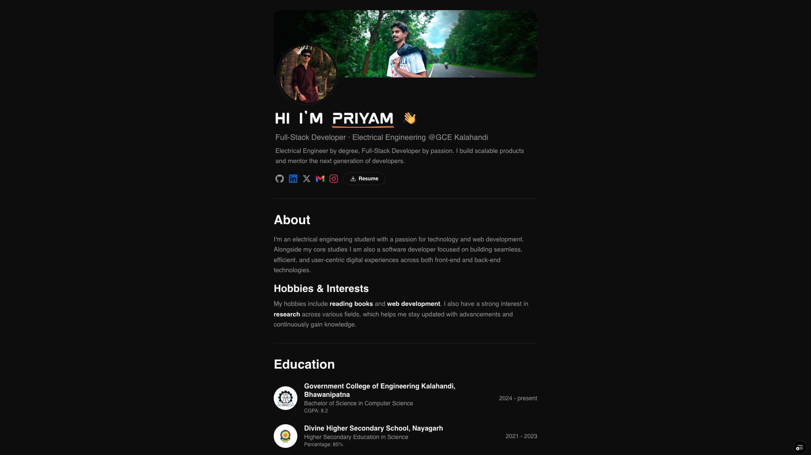
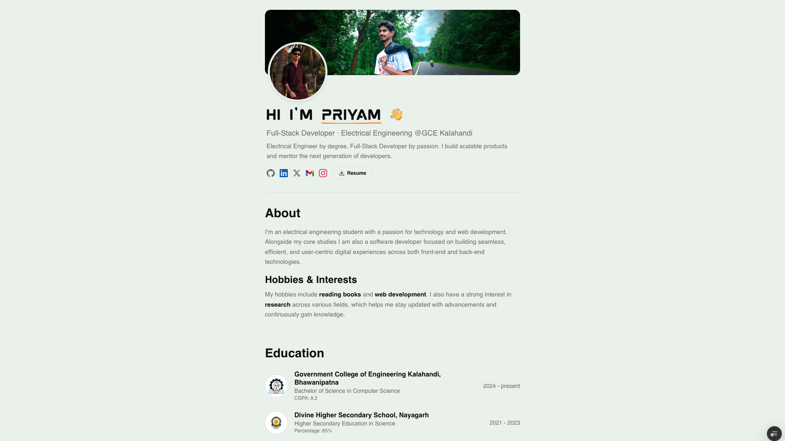

<div align="center">

# Gyanranjan Priyam — Portfolio

A modern, performant personal portfolio built with **Next.js 16**, **React 19**, and **Tailwind CSS 4**.

🔗 **[gyanranjanpriyam.tech](https://www.gyanranjanpriyam.tech)** 
🔗 **[priyam.tech](https://www.priyam.tech)**

</div>

## Preview

| Dark Mode | Light Mode |
|:---------:|:----------:|
|  |  |

## Tech Stack

| Category | Technologies |
|----------|-------------|
| **Framework** | Next.js 16 (App Router, Turbopack) |
| **UI** | React 19, Tailwind CSS 4, Radix UI, shadcn/ui |
| **Animations** | Framer Motion, GSAP, Lenis (smooth scroll) |
| **3D** | Three.js, Postprocessing |
| **Styling** | Sass, tw-animate-css |
| **Code Highlighting** | Shiki |
| **State Management** | Zustand |
| **Package Manager** | Bun |
| **Deployment** | Vercel |

## Features

- **Dark / Light Theme** with system preference detection and smooth toggle
- **Custom Intro Loader** with animated typography
- **Interactive Hero** with profile carousel and click-spark effects
- **Sections** — About, Education, Experience, Skills, Projects, Blog, GitHub Calendar, Contact
- **Blog Engine** with syntax-highlighted code blocks (Shiki), table of contents, read-aloud, and share buttons
- **Project Showcase** with image galleries and live/source links
- **GitHub Contribution Calendar** integrated via `react-github-calendar`
- **SEO Optimized** — dynamic sitemap, JSON-LD structured data (`Person`, `BlogPosting`, `CreativeWork`), OpenGraph & Twitter cards
- **Smooth Scroll** powered by Lenis
- **Fully Responsive** — mobile-first design

## Getting Started

### Prerequisites

- [Node.js](https://nodejs.org/) 18+ or [Bun](https://bun.sh/) 1.0+

### Installation

```bash
# Clone the repository
git clone https://github.com/Gyanranjan-Priyam/resume-portfolio.git
cd resume-portfolio

# Install dependencies
bun install
```

### Development

```bash
bun dev
```

Open [http://localhost:3000](http://localhost:3000) to view the site.

### Build

```bash
bun run build
bun start
```

## Project Structure

```
app/                  # Next.js App Router pages & layouts
  blog/               # Blog listing & dynamic [slug] pages
  projects/           # Projects listing & dynamic [id] pages
  sitemap.ts          # Dynamic sitemap generation
components/
  sections/           # Page sections (hero, about, skills, etc.)
  ui/                 # Reusable UI components (badge, card, tooltip, etc.)
  loader-component/   # Animated intro loader
data/                 # Static data (blogs, projects, education, skills)
hooks/                # Custom React hooks
lib/                  # Utilities
public/               # Static assets (fonts, images, resume)
```

## Deployment

Deployed on [Vercel](https://vercel.com). Push to `main` triggers automatic deployment.

## License

This project is open source and available under the [MIT License](LICENSE).

---

<div align="center">
  Built by <a href="https://www.gyanranjanpriyam.tech">Gyanranjan Priyam</a>
</div>
